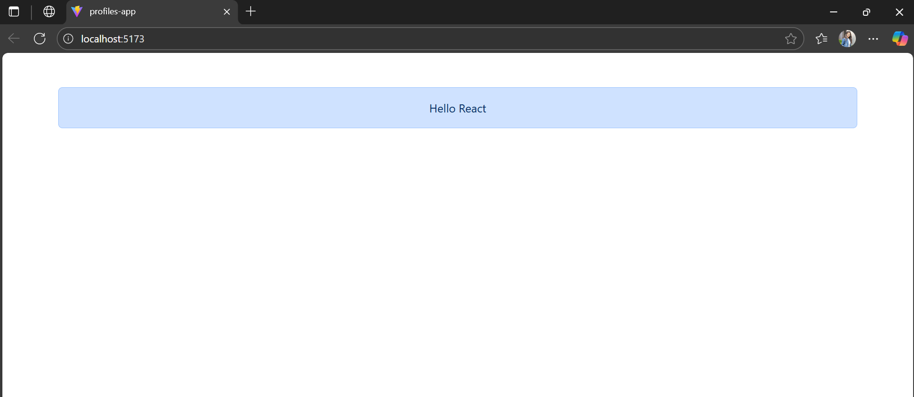
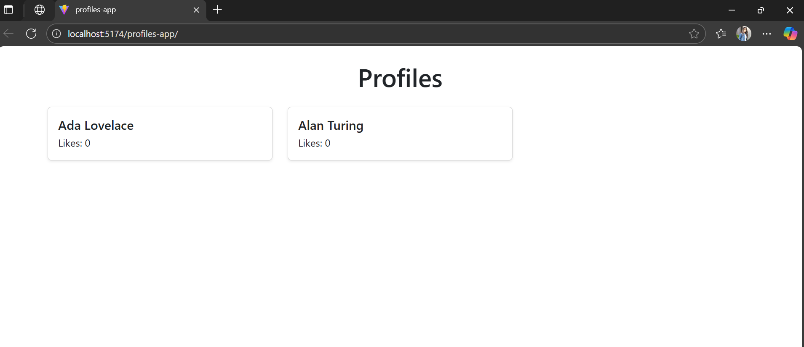

# Profiles App (Lab 1)

This is the single page application created using react + vite and bootstrap. The page display's Hello React.

## Part 1

## Commit link

https://github.com/vaishnavi-bachhav/profiles-app/commit/be3b9f9d0d325015c3fc88925bc6db980dbf8ac2

## Part 2

## Live app link

https://vaishnavi-bachhav.github.io/profiles-app/

## Part 3

